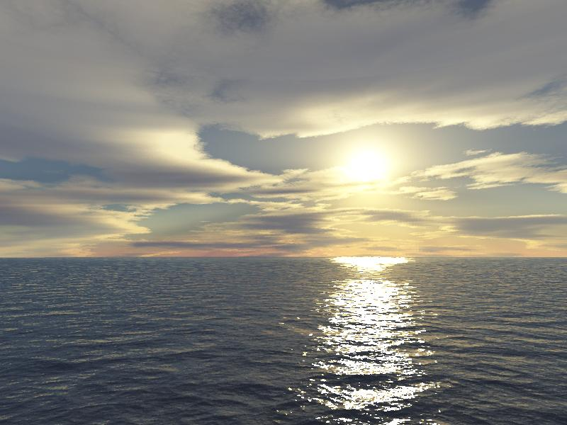
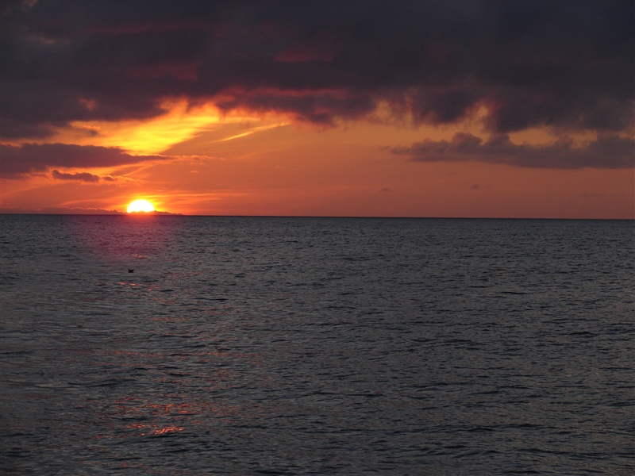
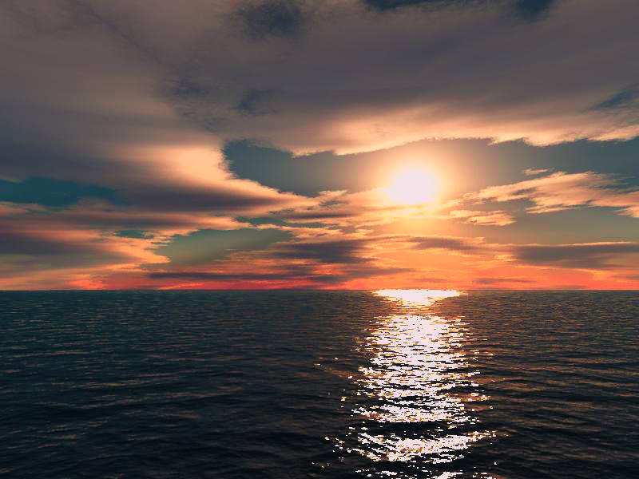
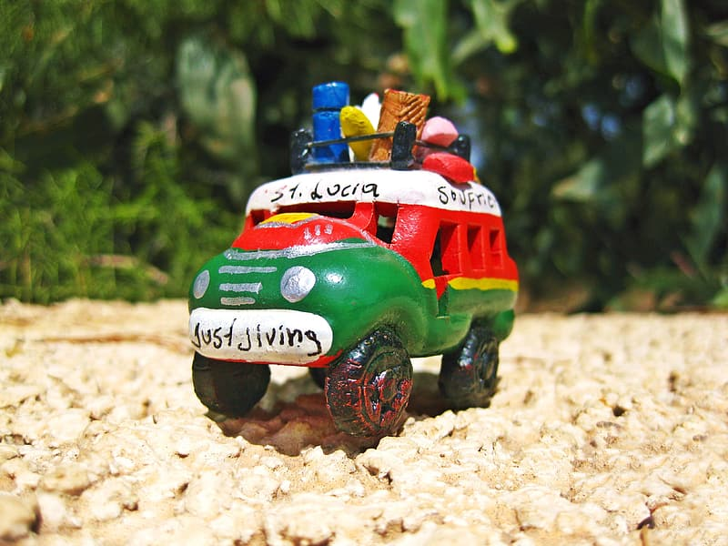
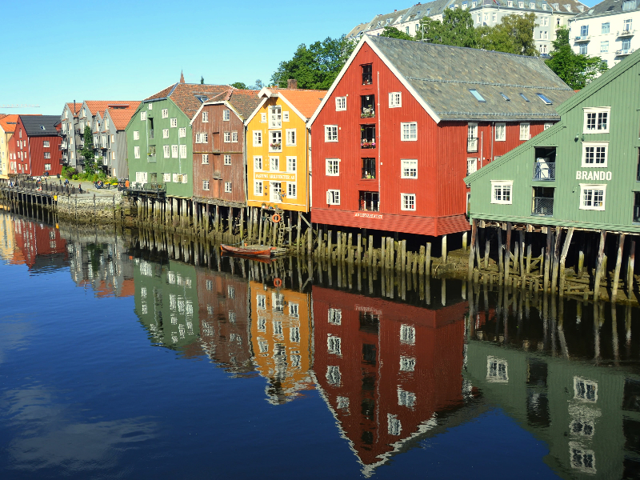

# ColorTransfer
Another very interesting work involving Peter Shirley. [Color Transfer between Images](https://www.researchgate.net/publication/220518215_Color_Transfer_between_Images) from Reinhard et al.
tackles color corrections (or color alteration in general) by transforming the RGB space to an orthogonal color space 
without correlations between the axes. Standard deviation and mean (of source and target image) serve as alteration quantities 
in this space.
Converting the data points back to RGB space gives the final color transfered image.

## Samples
Here are some examples of color transfers.

  
  
  

  
  
  

## Credits
Images taken from

S. Premoze and M. Ashikhmin, “Rendering Natural
Waters,” Proc. Pacific Graphics, IEEE CS Press, Los Alami-
tos, Calif., 2000, pp. 23-30

[NOOAA Photo Library](https://photolib.noaa.gov/Collections/National-Weather-Service/Other/emodule/627/eitem/19163)

Pxfuel: [NorwayHouses](https://www.pxfuel.com/en/free-photo-elszt)

Pikrepo: [Car](https://www.pikrepo.com/fjwol/red-and-blue-racing-car-scale-model)

